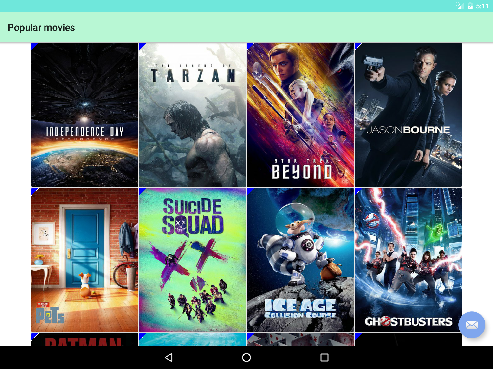

# theMovieDB_2_0
A movie app inspired by Udacity project

## Architecture
* Model-View-Presenter pattern for each screen
* Retrofit 2 + RxJava for reactive networking
* AutoValue + Moshi + Parcelable for POJO classes
* Dagger 2 + AutoDagger2 for auto dependency injection
* Debugdrawer and many modules for debug mode profiler
* Gradle BuildConfig for secret keys and API key load
* TMDb API for movie data

## Screenshots
* Splash screen

* Movie list in phone screen

* Movie details in phone screen

* Movie list in tablet screen

* Movie details in tablet screen

